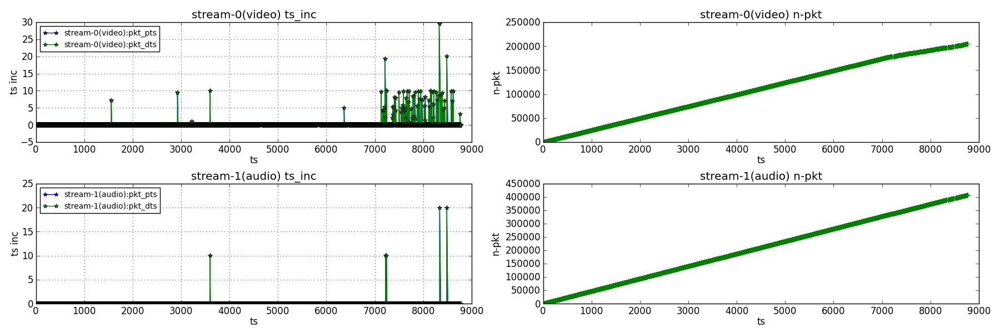
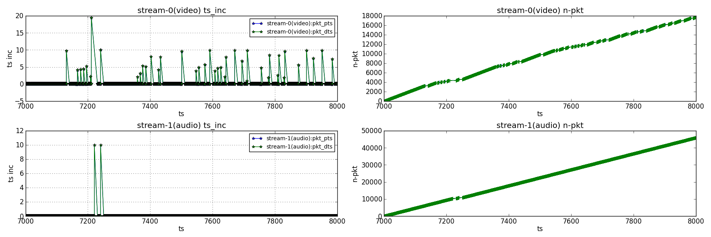
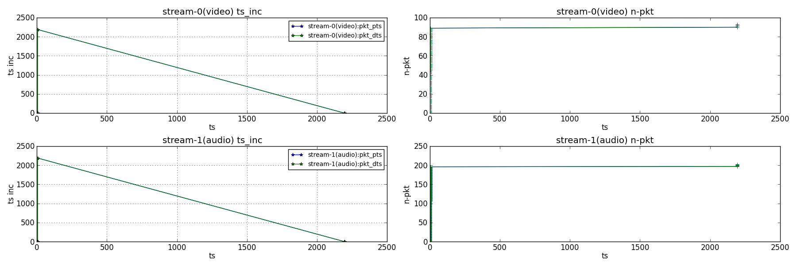
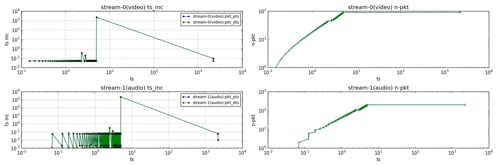

一个基于ffmpeg和python的时间戳分析工具

1. FFMPEG 用于获取视频时间戳. 可以从 zeranoe 上下载事先编译的版本。(注意把ffempg所在路径加入系统或用户的环境变量$PATH)
	- `zeranoe`: [http://ffmpeg.zeranoe.com/builds/](http://ffmpeg.zeranoe.com/builds/)

2. python + numpy + matplotlib 用于数据分析和画图显示. 懒得折腾numpy和matplotlib，可以安装 python-xy 或 winpython.
	- `python-xy`: [http://sourceforge.net/projects/python-xy/](http://sourceforge.net/projects/python-xy/)
	- `winpython`: [https://winpython.github.io/](https://winpython.github.io/)

# 如何使用 #

`$ python ffmpe_debug_ts.py -h`

	Usage: ffmpeg\_debug\_ts.py [options]
	
	Options:
	  -h, --help            show this help message and exit
	  -i INPUT, --input=INPUT
	                        movie to be analyzed
	  -l LOG, --log=LOG     log to be analyzed if you don't specify movie
	  -o OUT, --out=OUT     Name for saved picture.
	  -s START, --start=START
	                        start time
	  -e END, --end=END     end time
	  -d DECODER, --decoder=DECODER
	                        Decoder type: ffmpeg or ffprobe. [ffmpeg]
	  -t THRESHOLD, --threshold=THRESHOLD
	                        Time inc above the threshold will trigger error
	                        report.
	  -c, --compress        Whether use log scaling axises. [0]
	  -k SELECT, --select=SELECT
                        select time-stamp type for showing. [pkt_pts,pkt_dts]

# 实例分析 #

> $ python ffmpeg_debug_ts.py -i $MEDIA_PATH/movie1.flv

- 左列显示了码流中相邻两帧的时间戳变化。 正常情况下应该是一条直线。如果有数据丢失（时间跳变）则会显示为尖角脉冲。
- 右列显示了到当前时间戳的累计帧数。 正常情况下应该是一条递增的直线。如果有数据丢失（时间增加但数据量没怎么增加）则会显示为水平阶梯。
- 上面这个例子中视频流丢帧比较严重，音频流只有少量丢包。

当视频比较长时，数据都挤在一块，看起来不方便。可以使用 '-s' 和 '-e' 选项来放大数据丢失区域。在上面的例子中 'movie1.flv' 已解码过，二次分析时为了避免重复解码，可以使用 '-l' 选项指定已保存的时间戳数据文件。

> $ python ffmpeg_debug_ts.py -l $MEDIA_PATH/movie1.flv.ffmpeg.log -s 7000 -e 8000

有时候数据紊乱会导致时间戳跳变过大。下面这个例子中影片实际只有5秒，但是末尾有些错误数据导致时间戳从00:00:05一下跳到00:30:00。结果把0~5秒的数据都堆到坐标轴上一小段区间，什么也看不来。

> $ python ffmpeg_debug_ts.py -i $MEDIA_PATH/movie2.flv

为了防止时间跳变太大把正常的数据区间都挤压在一块什么也看不出来，可以使用 '-c' 选项对坐标轴进行对数（log）缩放。

> $ python ffmpeg_debug_ts.py -l $MEDIA_PATH/movie2.flv.ffmpeg.log -c

